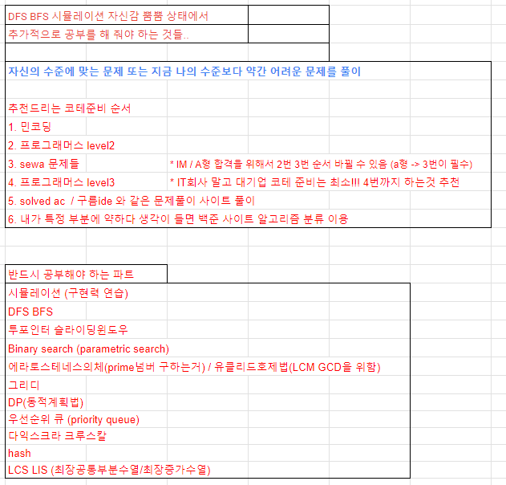

## java 함수 정리





```java
// 많이 쓰이는 함수들 정리

// 배열
// 오름차순 내림차순

 Arrays.sort(arr);

System.out.println(Arrays.toString(arr));

Integer[] collectionArr = {5,4,3,2,1}; // new Integer[10];

Arrays.sort(collectionArr, Collections.reverseOrder()); // 내림차순 정렬

System.out.println(Arrays.toString(collectionArr));

// int 배열을 Integer 배열로 바꾸는 경우

Integer[] temp = Arrays.stream(arr).boxed().toArray(Integer[]::new);

```

