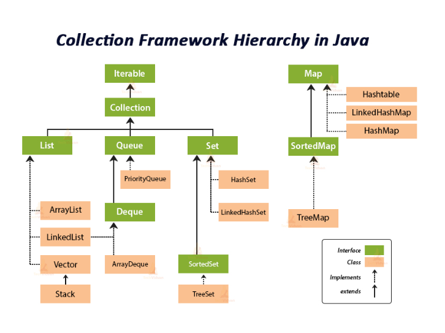

## java 함수 정리


  

```java
// 많이 쓰이는 함수들 정리

// 배열
// 오름차순 내림차순

 Arrays.sort(arr);

System.out.println(Arrays.toString(arr));

Integer[] collectionArr = {5,4,3,2,1}; // new Integer[10];

Arrays.sort(collectionArr, Collections.reverseOrder()); // 내림차순 정렬

System.out.println(Arrays.toString(collectionArr));

// int 배열을 Integer 배열로 바꾸는 경우

Integer[] temp = Arrays.stream(arr).boxed().toArray(Integer[]::new);

```


```java
// Input, String
BufferedReader br = new BufferedReader(new InputStreamReader(System.in));
StringTokenizer st = new StringTokenizer(br.readLine());

st = new StringTokenizer(br.readLine());
Integer.parseInt(st.nextToken());

Scanner sc = new Scanner(System.in);
sc.nextInt();

// 자르기
String[] strArray = str.split(" ");
String str = str.substring(1,3);
char c = str.charAt(2); // char형 반환

// 문자열 길이반환
str.length()

// 변경 불가능해서 substring 으로 잘라서 사용해야함

// 문자열 생성
StringBuilder sb = new StringBuilder();
sb.append("11");
sb.toString();
sb.reverse().toString();

// 문자열 대문자 소문자 변환
str = str.toUpperCase();
str = str.toLowerCase();

// 빈칸제거
str = str.tirm(); 

// 숫자를 문자열로 변환 int -> String
String three = String.valueOf(3); // i를 문자열로 변환 int -> String

// 숫자형태의 char를 int로 변환
int a = Character.getNumericValue();
int a = {숫자형태 char} '6' - '0';

// 위치 반환
int idx = str.indexOf("1"); 
int idx = str.lastIndexOf("."); // 마지막 . 의 위치 반환

// char 숫자인지 문자인지 판별
Character.isDigit('a');
Character.isLetter('a');
Character.isWhitespace(' '); // 공백인지 판별


```

sdf


```java
// String
// length 반환
//int arrLength = arr1.length // -> 배열 길이

String str = "123123";
int strLength = str.length();

StringBuilder sb = new StringBuilder();
sb.append();
sb.toString();


```

sdf


```java
// Array
int arr1[] = {1,3,2,1,6,4,2};
Integer arr2[] = {1,3,2,1,6,4,2};

// 배열 길이 반환
arr1.length


Arrays.sort(arr1);

Arrays.sort(arr2, Collections.reverseOrder());

Arrays.binarySearch(arr1, 2); // 정렬하면 특정값(2) 반환가능
// Arrays.binarySortOrder(arr1);

int temp[] = Arrays.copyOfRange(arr1,2,5);

// List convertedList = Arrays.asList(arr1); // 오류 확인?

// collect(Collectors.toList());

//        int[] intArray = {10, 20, 30, 40};
//        ArrayList<Integer> integerArray = (ArrayList<Integer>) 						 //        Arrays.stream(intArray).boxed().collect(Collectors.toList());

int arrLength = arr1.length // -> 배열 길이

String str = "123123";
int strLength = str.length();

System.out.println(Arrays.toString(arr));

```

sdf


Collection




```java
// List

// List<Integer> list = new ArrayList<Integer>(); 업케스팅 왜 안되는지?
// List<Integer> linkedList = new LinkedList<Integer>();

// Collection 길이 반환
ArrayList<Integer> arrayList = new ArrayList<Integer>();
int arrayListLength = arrayList.size();

arrayList.add();
arrayList.set();
arrayList.remove();
arrayList.contains();
arrayList.indexOf();

Iterator it = arrayList.iterator();

while(it.hasNext()){
    System.out.println(it.next());
}

while(it.hasPrevious()){
    System.out.println(it.next());
}

if(arrayList.indexOf(value) < 0 ){ // 값을 중복없이 넣고 싶을때
    // 값 없으면 음수 반환환
    arrayList.put(value);
}

for(int i = 0; i < arrayList.size(); i++){
    arrayList.get(i).intValue(); // Integer -> int
}

Collections.sort(arrayList); // List 정렬

// Set -> ArrayList
Set<String> set = new HashSet<String>();
LIST<String> menuList = new ArrayList<>(set);

```

sdf


```java
// 정렬
compareTo

<? extends T> T의 하위
<? super T> T의 상위
```

sdf


```java
// Comparator Comparable

Comparator compare // 객체
    
new Comaparator(){
    @Override
    public int compare(int a, int b){
        return a - b; // 오름차순 -> 양수인 경우에 자리수를 바꿈
    }
}

Comparable compareTo // 객체간 비교 String 사전순 비교

<? extends T> T의 하위
<? super T> T의 상위
```

sdf


```java
// Stack
Stack<String> st = new Stack<>();
List<String> st = new Stack<>(); // -> Stack 기능사용 불가능

st.peek();
st.push();
st.pop();

// iterator 생성
Iterator it = st.iterator();


```

sdf


```java
// Queue

Queue<Integer> q = new LinkedList<>();

q.add();

q.peek(); // 프론트값 반환

q.remove();
q.poll();

q.clear();

q.isEmpty();


Queue<Node> queue=new LinkedList<>();
queue.add(new Node(1,2,3));
Node node= queue.poll();

PriorityQueue<Integer> pq = PriorityQueue<Integer>(); // 최소힙
PriorityQueue<Integer> pq = PriorityQueue<Integer>(Collections.reverseOrder()); // 최대힙

pq.add(3);

pq.remove();

pq.peek(); // root값 추출

PriorityQueue<PQNode> pq1 = new PriorityQueue<>(PQNode::compareTo);
pq1.add(new PQNode(1,2));
pq1.add(new PQNode(1,1));
pq1.add(new PQNode(2,3));
pq1.add(new PQNode(2,1));

while(!pq1.isEmpty()){
    PQNode pqnode = pq1.peek();
    System.out.println(pqnode.y+" "+pqnode.x);
    pq1.remove();
}


}

class Node {
    int y;
    int x;
    int dist;

    Node(int y,int x,int dist){
        this.y=y;
        this.x=x;
        this.dist=dist;
    }
}

class PQNode{
    int y;
    int x;

    PQNode(int y,int x){
        this.y=y;
        this.x=x;
    }

    // 비교 함수 만들어야함!!
    public int compareTo(PQNode p) {
        if(this.y < p.x) {
            return -1; // 오름차순
        }
        else if(this.y == p.y) {
            if(this.x < p.x) {
                return -1;
            }
        }
        return 1;
    }
```

sdf


```java
// Deque


```

sdf


```java
// Map
HashMap<String, Integer> hm = new HashMap<String, Integer>();

hm.put("java", 0);

hm.get("java");

hm.containsKey("java");

hm.containsValue("java");

hm.getOrDefault("java", 3); // 값이있으면 get 없으면 설정정

for(String key :hm.keySet()){ // set 반환
    System.out.println(key);
}

```

sdf


```java
// Set


```

sdf


```java
// Math
Math.max(10,2);
Math.min(3,2);

Math.abs(-5);

Math.ceil(-3.2);  // 올림
Math.floor(-3.2); // 내림
Math.round(-3.2); // 반올림

// 3-1. 소수 둘째, 셋째 자리에서 반올림 하고 싶다면
double a = 1.23456;
String b = String.format("%.1f", a);	// .1f는 둘째자리에서 반올림

// 4. 제곱 제곱근
Math.pow(2, 2);		// 2^2 = 4
Math.sqrt(4);		// 2

```

sdf


```java
// Stream .filter() .map() .toArray() .findFirst() .orElse()
return people.stream()
    	.filter(p -> p.hasPhoneNumber(number))
    	.findFirst()
    	.orElse(null);

== (equals)
    
for (Person p :people){
    if(p.hasPhoneNumber(number)){
        return p;
    }
    return null;
}


return IntStream.range(0, 3)
	    .filter(i -> corrects[i] == maxCorrects)
	    .map(i -> i+1)
    	.toArray();
```


